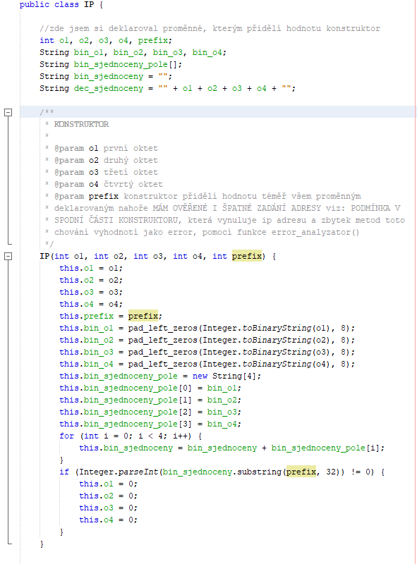
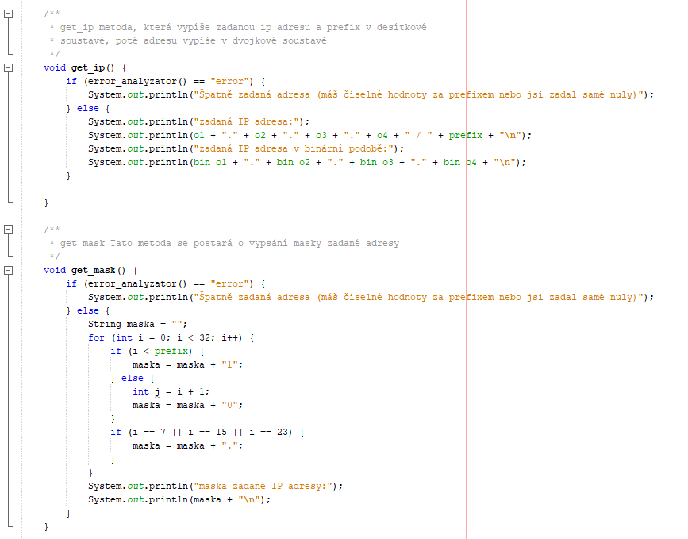
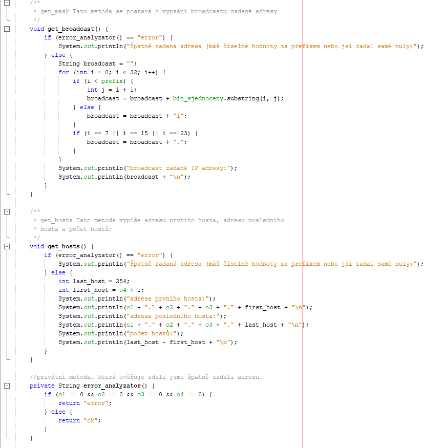
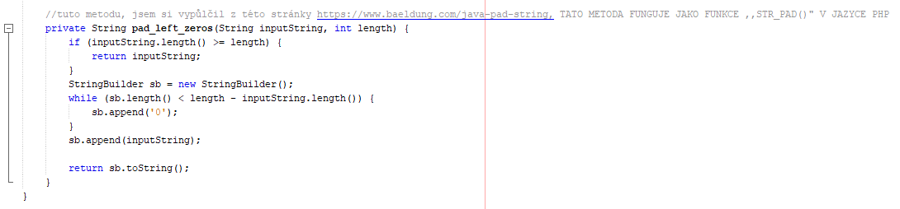
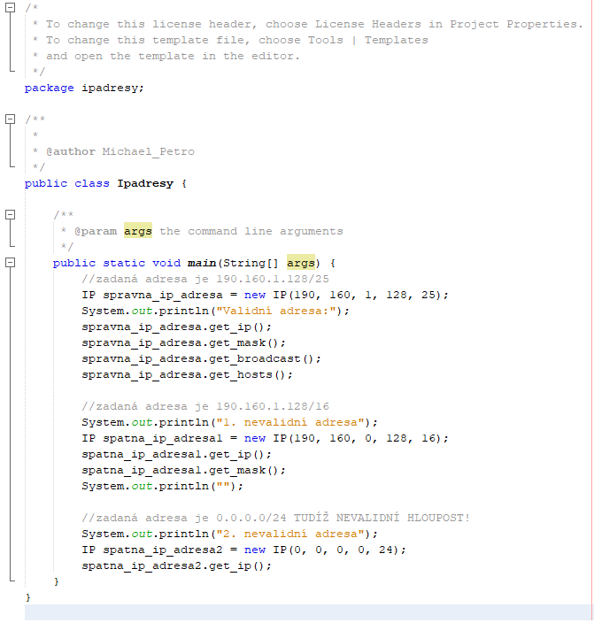
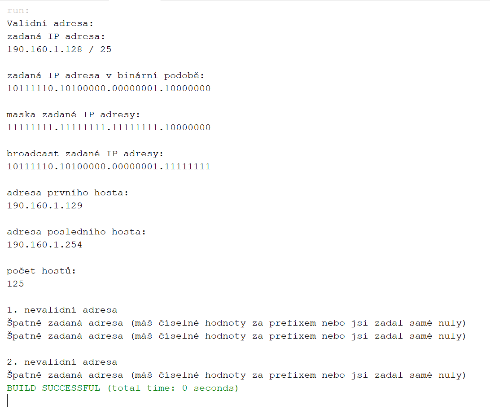

# Analyzátor sítě
#### naprogramovaný v programovacím jazyce JAVA
## Zde jsou k dispozici screenshoty zdrojového kódu mého analyzátoru sítě:
#### v programu je chyba, kterou jsem se snažil vyřešit, ale všiml jsem si jí pozdě   chyba je v posledním hostu.. unikla mi jedna podrobnost a můj program tohoto hosta vypočítává špatně... tudíž mám špatně i host_count.. snad mne alespoň trochu omlouvá, že jsem si té chyby plně vědom a dokonce jsem se jí snažil v rámci možností opravit.. ale jak říkám.. bylo pozdě.

### class IP{

### }

### hlavní program public class ipadresy{

### }

### Toto vypsal můj program:

