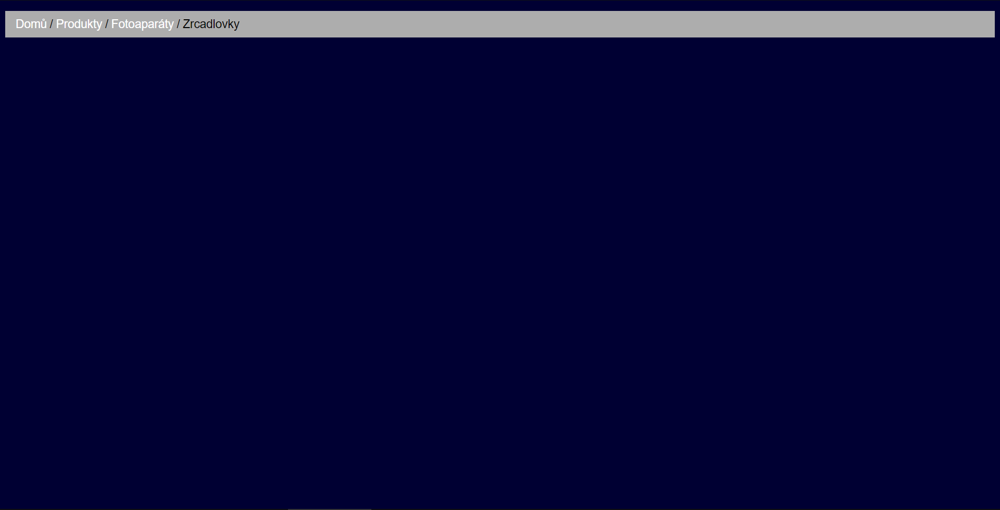
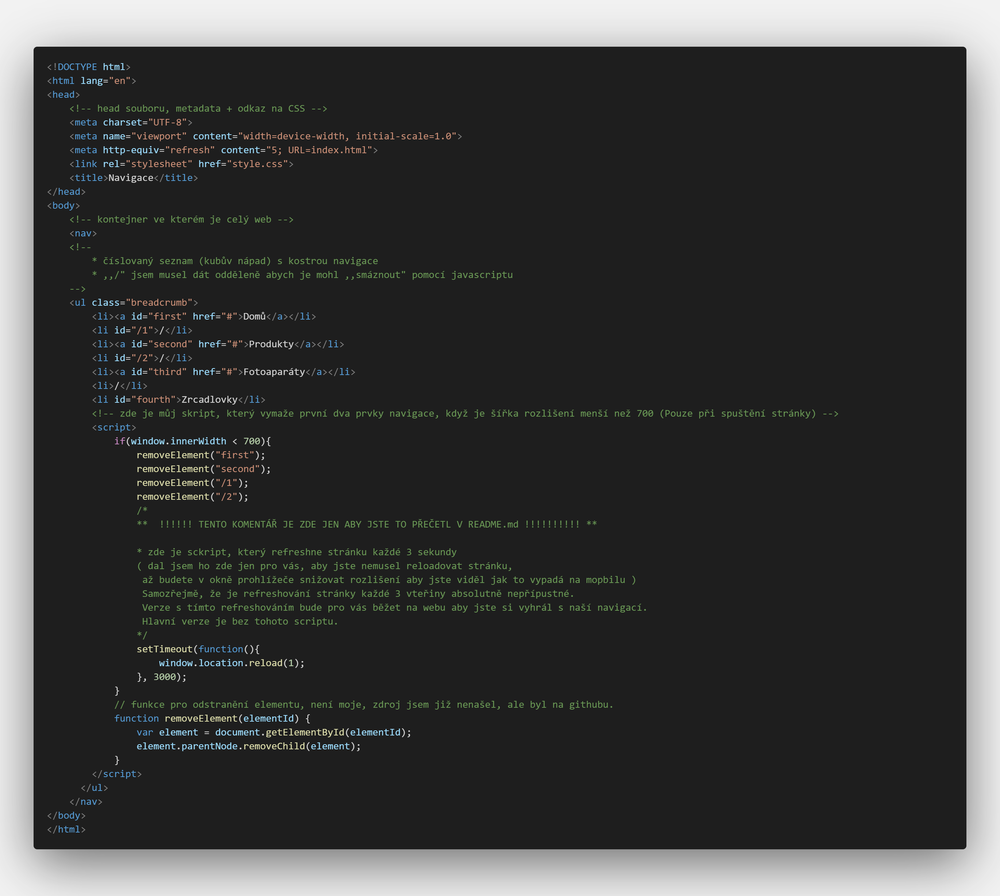
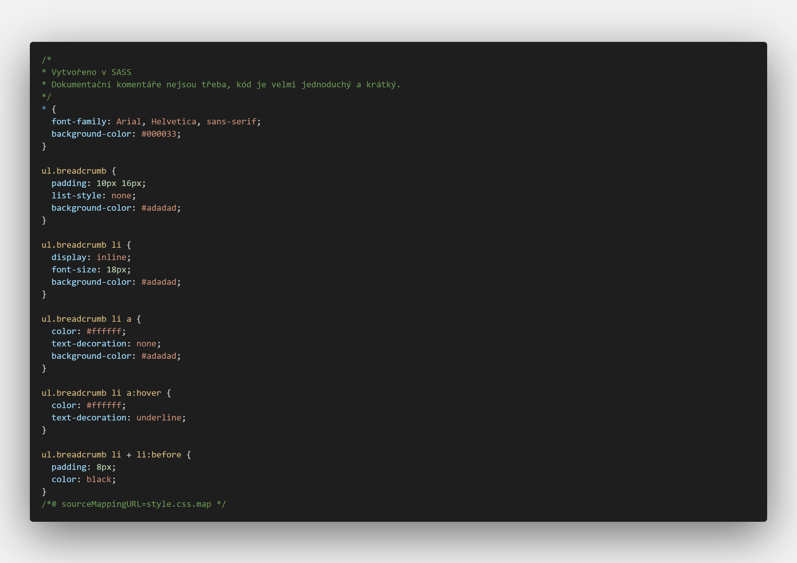

# Drobečková Navigace
## Michael Petro, Jakub Čapek
#### Statická webová stránka s využitím javascriptu

# Matice odpovědnosti
## Michael - vytvořil javascript + udělal komentáře a dokumentaci README
## Jakub - nadesignoval naší webovou stránku a udělal celý základ HTML (strávil nad prací nejvíce času)

# Screenshoty  
# Ukázka
#### 
## Desktop:

## Mobile:

# kódy
## HTML

## CSS

## Zde vám poskytuji odkaz na testovací stránku (máte tam menší skript, který refreshne stránku každé 3 sekundy a to zajistí, že si  budete moct hrát s rozlišením) -> [Odkaz na testovací stránku](http://michael.petro.sweb.cz/WAP/DrobeckovaNavigace/Drobecky/index.html)
## Zde je odkaz na naší navigaci, tudíž jak by vypadala na normálním webu (bez refreshování, v jakém rozlišení jí zapenete, v takovém bude). [Odkaz na legitimní stránku](http://michael.petro.sweb.cz/WAP/DrobeckovaNavigace/index.html)

# Závěr
## Michael - Bylo to takové seznámení s JavaScriptem, javascript nejspíše budem můj velký nemesis, nesnáším ho
## Jakub - Tvorba drobečkové navigace mne vskutku bavila.
