# Generování SQL SELECT.   [SELECT, FROM, WHERE, ORDER BY]
## Tento program mě naučil pracovat s textovými řetězci v Javě a jsem za to vděčný.

### class select.java
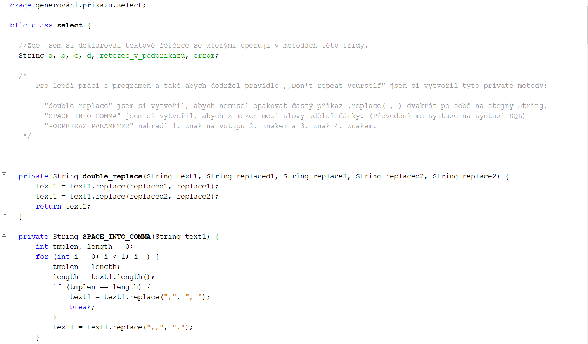
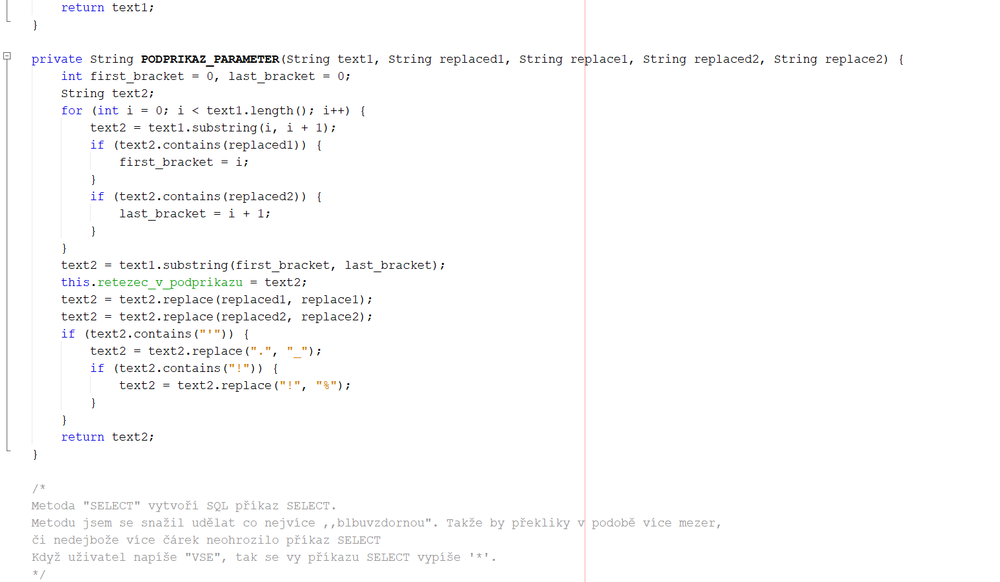
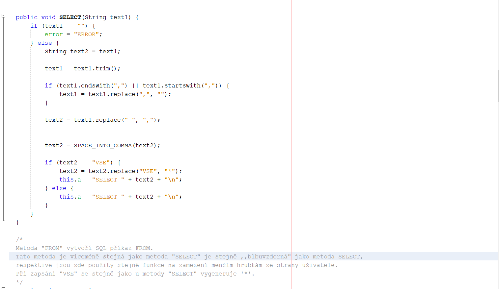
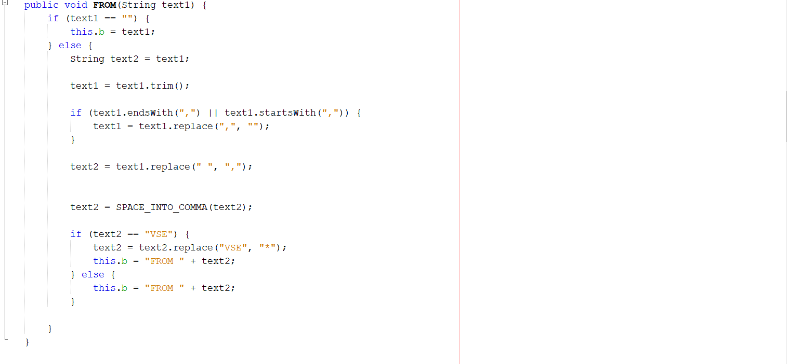
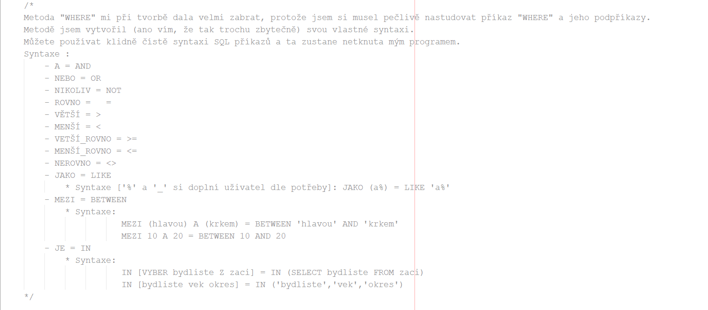
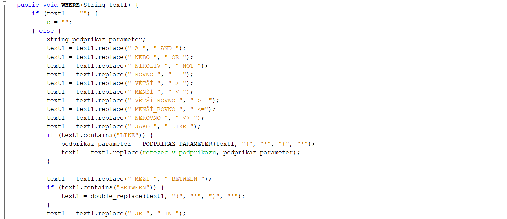
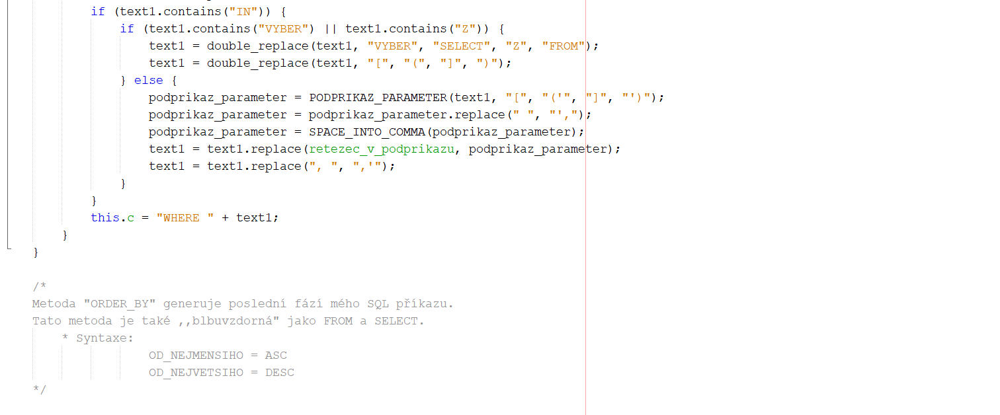
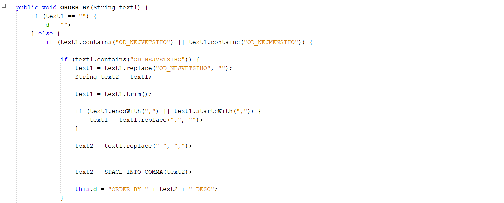
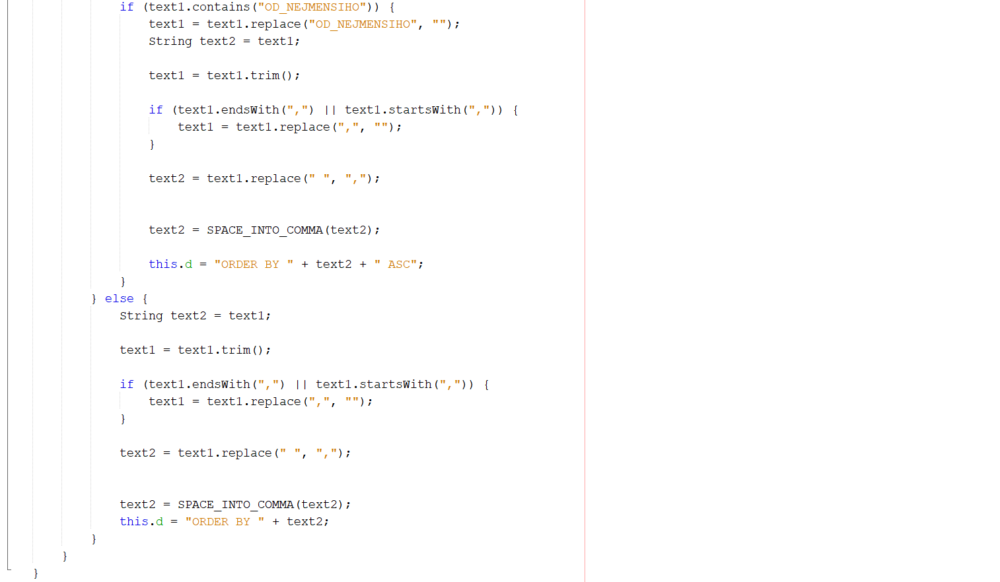
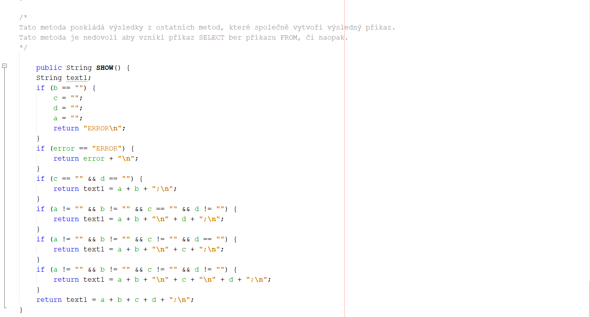

## main Generátor příkazu select
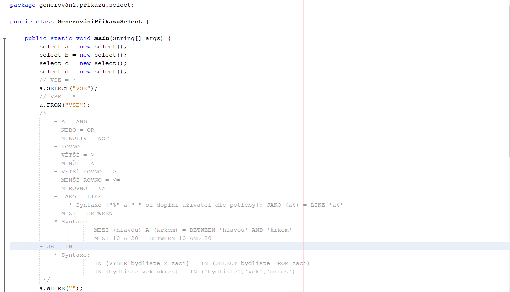
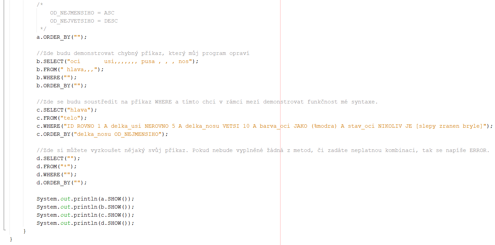

## Zde je demonstrován můj program.

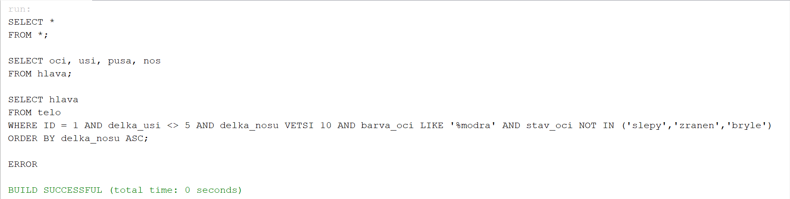
