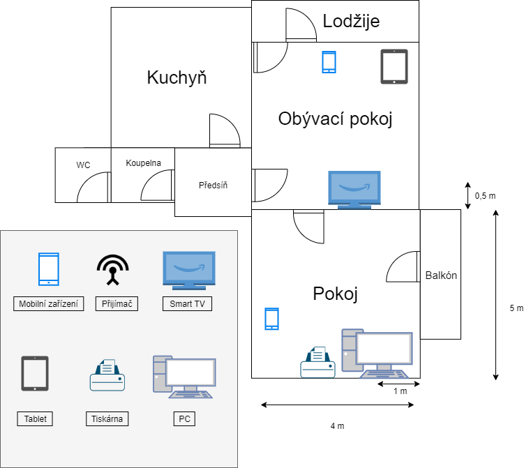
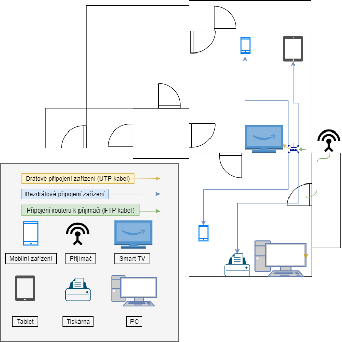
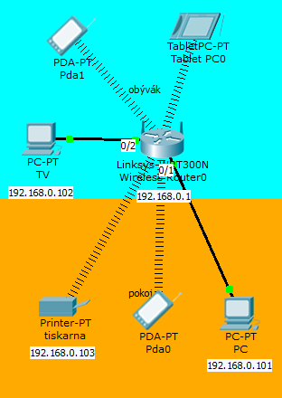

# Návrh domácí sítě
### Michael Petro

##### ( V této práci mužete nalézt podobnosti s prací mého spolužáka [Honzy Tančiboka](https://github.com/JanTancikULTRA?tab=repositories), protože jsem mu pomáhal při tvoření jeho sítě, hlavně s vybíráním zařízení, která využije ve své síti. )

#### Na celý tento úkol jsem se snažil přihlížet jako na zakázku pro zákazníka, který si nadiktoval nějaká svá zařízení, které by na to chtěl připojit a následně mě pustil dovnitř k němu domů, ať si naplánuju připojení (Tudíž spíš z pohledu praxe). Protože jsem již u pár takových připojovaček byl, tak je to pro mě přirozenější na to koukat jako na zakázku, než na tvorbu pro mne (jsem velmi nenáročný). Možná se mě ptáte jaký je rozdíl mezi zakázkou a tvorbu pro sebe samotného? No je to velmi jednoduché, když jdete dělat síť pro sebe, musíte si koupit třeba 40 metrů lišt za 590 Kč, ale když jdete někomu dělat internet, tak máte 40 metrů pořízených na firmu a zákazníkovy dáte zaplatit pouze to, co jste na něj využil. V tomto je hlavní a zásadní rozdíl (ovšem, že ne jen u lišt, ale u UTP atd..). Zmiňuji to jen proto, aby vás při čtení mé dokumentace neuvedlo do rozpaku slovo zákazník (v němčině der Kunde nebo také die Kundschaft).

# Zadání

### Můj zakazník si tedy přeje síť s wifi, která by měla pokrýt obývací pokoj a pokoj jeho syna.

### Zákazník mi řekl a ukázal, která zařízení vlastní a chce je připojit.

## zařízení, která připojuji

<ul>
<li>Smart TV</li>
<li>Stolní počítač</li>
<li>Tiskárna</li>
<li>Tablet a mobily</li>
</ul>

# Zhodnocení a následné řešení této sítě

### Vyhodnotil jsem, že nejlepší připojení bude bezdrátové přes přijímač z firmy,mikroTIK(mikroTIK SXT), protože vzhledem k struktuře naší sítě (která je tvořená z 95% mikroTIKY) to bude nejpřehlednější řešení, která nám poskytne značné výhody při řešení problémů s připojením našeho zákazníka do budoucna. Musím zavést bezdrátové připojení, protože v okolí neposkytuji adsl připojení a můj zákazník má výhled na naše AP umístěné necelých 500 metrů od něj. 

##### Další zařízení v síti (router) budou též od výrobce mikroTIK, switche nebudou v tomto případě potřeba.

### Dobrý výhled na AP má náš zákazník z balkónu a je to strategicky nejlepší místo, z kterého bude jednoduché rozvést síť na potřebná místa skrz balkonové dveře.

## Zde můžeme vidět nákres bytu našeho zákazníka i s polohou jeho zařízení.   (mobily a tablet mají zadanou přibližnou polohu)

### Nejlepší místo pro router bude vedle televizního zařízení v obýváku, wifi dosáhne s celkem dobrým signálem do kuchyně a vedlejšího pokoje,ale hlavně ušetříme za lišty, protože kabeláž z routeru do PC se bude tahat stejným místem, kterým bude zavedena do routeru.

## Zde vyřeším, která zařízení jak připojím

##### Snažím se myslet do budoucna, je možné že zařízení která má jdou připojit přes bezdrátově, ale musím myslet i na to, že to tak být nemusí a pokusím se zavést i drátové spojení do zařízení jako je TV a PC. JE VŽDY LEPŠÍ MYSLET NA TO CO BUDE NEŽLI NA TO CO JE. Například tiskárna bude buď připojená k PC nebo bezdrátově, my ji tedy započteme do zařízení v kategorii BEZDRÁTOVÉHO PŘIPOJENÍ.

<ul>
<li>Smart TV bude připojeno kabelem z routeru vedle tv</li>
<li>Stolní počítač bude připojen drátově z routeru.</li>
<li>Tiskárna bude připojena bezdrátově</li>
<li>Tablety a mobily budou samozřejmě připojeny též bezdrátově.</li>
</ul>

## zde můžete vidět nákres mého řešení.

# Zařízení

* Přijímač: [MikroTik RouterBOARD RBSXTG-5HPacD-SA, SXT SA5 ac, L4](https://www.abctech.cz/?cls=stoitem&stiid=14190&gclid=EAIaIQobChMIrteO7MeY6QIVDM53Ch1djAmTEAQYASABEgJ3WPD_BwE)
* Router: [Mikrotik RouterBOARD RB952Ui-5ac2nD](https://www.czc.cz/mikrotik-routerboard-rb952ui-5ac2nd/195329/produkt?gclid=EAIaIQobChMIxrXC5MOY6QIVi-J3Ch1ZTQfOEAQYAiABEgJw0fD_BwE)

# Topologie
#### Logickou část mé sítě jsem stvořil v PacketTraceru

#### V složce [ PacketTracer](PacketTracer) naleznete soubor [ návrh-sítě.pkt ](PacketTracer/návrh-sítě.pkt) který si načtěte do packet traceru a prozkoumejte si ji jak je libo.

##### Tuto část práce mi pomohl stvořit [Jakub Čapek](https://github.com/NiteNoizeCZ)

# Zapojení sítě

## Materiál

+ FTP kabel: [Kabel FTP patchcord, Cat.5e, RJ45 M/25m, stíněný, šedý](https://www.eva.cz/zbozi/IT4385/kabel-ftp-patchcord-cat-5e-rj45-m-25m-stineny-sedy/?gclid=EAIaIQobChMIuqaxu_aZ6QIVx-J3Ch0k3w5dEAQYBCABEgIJ6_D_BwE)

+ UTP kabel: [PATCH kabel UTP 5E, 25m](https://shop.emos.cz/2309010100-patch-kabel-utp-5e,-25m)

+ Konektor pro UTP: [KONEKTOR RJ-45 nestíněný](https://www.kenex.cz/metalicka-kabelaz/konektor-rj-45/?gclid=EAIaIQobChMIxaeonuqZ6QIVwp13Ch3qTQ1zEAQYAyABEgKvVfD_BwE)

+ Konektor pro FTP: [Konektor RJ-45 stíněný](https://www.vp-shop.cz/Konektor-RJ-45-stineny-univerzalni-d345.htm?gclid=EAIaIQobChMI4qPHzeqZ6QIVwud3Ch3qcQdLEAQYByABEgJf1fD_BwE)

+ Lišty: [Soklová lišta Fatra 1363 PVC 112 (Páska, která zakryje kabely pod sebou... vypadá jak lišta)](https://www.floorwood.cz/soklova-pvc-lista-fatra-1363-342-delka-40m/?gclid=EAIaIQobChMIkfbo68WY6QIVWeN3Ch2iIQwOEAQYAiABEgITX_D_BwE)

+ Příchytky na kabel: [PŘÍCHYTKA PRO KULATÝ KABEL BÍLÁ - PRŮMĚR 6 MM](https://www.osvetleniaz.cz/prichytky-kabelove/prichytka-pro-kulaty-kabel-bila-prumer-6-mm/?gclid=EAIaIQobChMIz-3no-mZ6QIVjLd3Ch3jNAZzEAQYAiABEgJUpfD_BwE)

## Quantita materiálu

+ 7 metrů [FTP kabelu](https://www.eva.cz/zbozi/IT4385/kabel-ftp-patchcord-cat-5e-rj45-m-25m-stineny-sedy/?gclid=EAIaIQobChMIuqaxu_aZ6QIVx-J3Ch0k3w5dEAQYBCABEgIJ6_D_BwE)

+ 9 metrů [UTP kabelu](https://shop.emos.cz/2309010100-patch-kabel-utp-5e,-25m) (od routeru do pc + rezerva) + 1 metr [UTP kabelu](https://shop.emos.cz/2309010100-patch-kabel-utp-5e,-25m)(od routeru do TV)

+ 4x [příchytky na kabel](https://www.osvetleniaz.cz/prichytky-kabelove/prichytka-pro-kulaty-kabel-bila-prumer-6-mm/?gclid=EAIaIQobChMIz-3no-mZ6QIVjLd3Ch3jNAZzEAQYAiABEgJUpfD_BwE)

+ 1x [stíněný RJ-45](https://www.vp-shop.cz/Konektor-RJ-45-stineny-univerzalni-d345.htm?gclid=EAIaIQobChMI4qPHzeqZ6QIVwud3Ch3qcQdLEAQYByABEgJf1fD_BwE)

+ 3x [nestíněný RJ-45 ](https://www.kenex.cz/metalicka-kabelaz/konektor-rj-45/?gclid=EAIaIQobChMIxaeonuqZ6QIVwp13Ch3qTQ1zEAQYAyABEgKvVfD_BwE)

+ 6 metrů [lišt](https://www.floorwood.cz/soklova-pvc-lista-fatra-1363-342-delka-40m/?gclid=EAIaIQobChMIkfbo68WY6QIVWeN3Ch2iIQwOEAQYAiABEgITX_D_BwE)

## provedení:

#### Nejdříve ze všeho jsem musel nainstalovat [přijímač](https://www.abctech.cz/?cls=stoitem&stiid=14190&gclid=EAIaIQobChMIrteO7MeY6QIVDM53Ch1djAmTEAQYASABEgJ3WPD_BwE) a nastavit jej.. Musel jsem se připojit přes utp kabel k na balkóně nainstalovanému [přijímači](https://www.abctech.cz/?cls=stoitem&stiid=14190&gclid=EAIaIQobChMIrteO7MeY6QIVDM53Ch1djAmTEAQYASABEgJ3WPD_BwE) a nakonfigurovat jej pro AP na které ho připojuji. Poté jsem mohl začít s tvorbou kabeláže k [routeru](https://www.czc.cz/mikrotik-routerboard-rb952ui-5ac2nd/195329/produkt?gclid=EAIaIQobChMIxrXC5MOY6QIVi-J3Ch1ZTQfOEAQYAiABEgJw0fD_BwE).

#### Pro propojení přijímače a routeru využiji [FTP kabel ](https://www.eva.cz/zbozi/IT4385/kabel-ftp-patchcord-cat-5e-rj45-m-25m-stineny-sedy/?gclid=EAIaIQobChMIuqaxu_aZ6QIVx-J3Ch0k3w5dEAQYBCABEgIJ6_D_BwE), který bude mít [stíněný RJ-45 konektor](https://www.vp-shop.cz/Konektor-RJ-45-stineny-univerzalni-d345.htm?gclid=EAIaIQobChMI4qPHzeqZ6QIVwud3Ch3qcQdLEAQYByABEgJf1fD_BwE), protože bude odlolnější vůči vnějším vlivům na balkónku našeho zákazníka (Déšť atp...). Kabel bude na balkónku přitlučen ke zdi ([ PŘÍCHYTKA PRO KULATÝ KABEL ](https://www.osvetleniaz.cz/prichytky-kabelove/prichytka-pro-kulaty-kabel-bila-prumer-6-mm/?gclid=EAIaIQobChMIz-3no-mZ6QIVjLd3Ch3jNAZzEAQYAiABEgJUpfD_BwE)) a proveden balkonovými dveřmi do bytu, pro vyvrtání orvoru jsem použil potřebný vrták k tomu abych se dostal skrz ,,práh" balkónku. Dále jsem musel vyvrtat díru do obývacího prostoru zákazníka. Když jsem provedl FTP kabel do obývacího pokoje, tak jsem na kabel nakrimpoval [stíněný RJ-45 konektor](https://www.vp-shop.cz/Konektor-RJ-45-stineny-univerzalni-d345.htm?gclid=EAIaIQobChMI4qPHzeqZ6QIVwud3Ch3qcQdLEAQYByABEgJf1fD_BwE). 

#### Po nainstalování FTP kabelu jsem se pustil do konfigurace [routeru](https://www.czc.cz/mikrotik-routerboard-rb952ui-5ac2nd/195329/produkt?gclid=EAIaIQobChMIxrXC5MOY6QIVi-J3Ch1ZTQfOEAQYAiABEgJw0fD_BwE). Při konfiguraci si zakazník zadal své heslo a jméno WIFI sítě a rovnou vyzkoušel její funkčnost.   ( to, jak jsem nakonfiguroval router a vytvořil topologii sítě zjistíte podprobně v [souboru z mého PacketTraceru](PacketTracer/návrh-sítě.pkt) )

#### Poté co jsem dokonfiguroval router jsem si připravil [UTP kabel](https://shop.emos.cz/2309010100-patch-kabel-utp-5e,-25m), který po nakrimpování připojím k SMART TV. Poté jsem otvorem, který jsem vyvrtal do obýváku, protáhl [UTP kabel](https://shop.emos.cz/2309010100-patch-kabel-utp-5e,-25m) z [routeru](https://www.czc.cz/mikrotik-routerboard-rb952ui-5ac2nd/195329/produkt?gclid=EAIaIQobChMIxrXC5MOY6QIVi-J3Ch1ZTQfOEAQYAiABEgJw0fD_BwE) až k pc na druhé straně pokoje. Kabely v pokoji a obýváku jsem samozřejmě nakrimpoval [ nestíněným konektorem RJ-45](https://www.kenex.cz/metalicka-kabelaz/konektor-rj-45/?gclid=EAIaIQobChMIxaeonuqZ6QIVwp13Ch3qTQ1zEAQYAyABEgKvVfD_BwE) a připojil je do patřičných zařízení.

#### Ve finále jsem už jen zadělal kabeláž do [lišt](https://www.floorwood.cz/soklova-pvc-lista-fatra-1363-342-delka-40m/?gclid=EAIaIQobChMIkfbo68WY6QIVWeN3Ch2iIQwOEAQYAiABEgITX_D_BwE) a vystavil zákazníkovy paragon.

# Ceník

### Ceny jsou čistě orientační, protože ne vždy zboží najdete za tuto cenu. 

#### Též bych také chtěl upozornit, že se ceny nebudou schodovat s těmi na odkazech, které v mé práci poskytuji, protože, jak jsem zmiňoval na začátku své práce, beru to co zaplatí zákazník, né to kolik stojí celkový produkt (např kabeláž).

<ul>
<li>Přijímač: 2 885 Kč,-</li>
<li>Router: 1 239 Kč,-</li>
<li>
Kabeláž:
<ul>
    <li> UTP: 168 Kč,-
        <ul><li>nestíněný RJ-45: 12 Kč,-</li></ul>
    </li>
    <li> FTP: 50 Kč,-
        <ul><li>stíněný RJ-45: 7 Kč,-</li></ul>
    </li>
    <li>Lišty: 93 Kč,-</li>
    <li>Příchytky na kabel: 2 Kč,-</li>
</ul>
</li>
</ul>

# Celková cena činní 4 456 Kč,-
