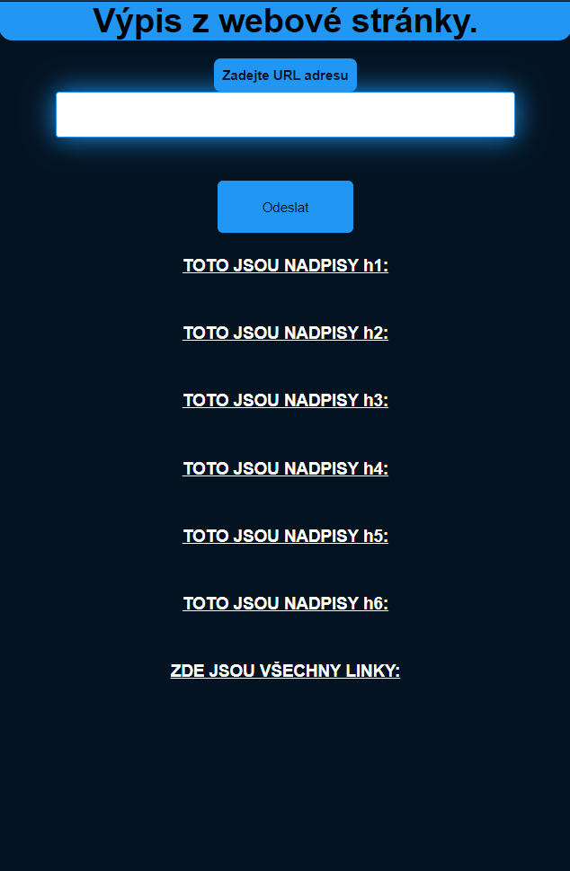

# Webová aplikace
## Michael Petro, Jakub Čapek, Dominik Tichý
#### analyzátor zdrojového kódu webové stránky   (webpage source code analyzator)

# Matice odpovědnosti
## Michael - vytvořil PHP funkce + udělal dokumentaci README a komentáře funkcí PHP 
## Dominik - Vytvořil HTML začátek + zpracoval program z Michalových funkcí + komentáře k svému kusu programu
## Jakub - nadesignoval naší webovou stránku + komentáře k css

# Screenshoty  
# Ukázka
#### Skenování stránky https://www.youtube.com
## Desktop:
#### Před vložením URL

#### Po vložení URL

## Mobile:
#### Před vložením URL

#### Po vložení URL

# Kódy
## PHP

## CSS

# Zde naleznete celou stránku -> [Odkaz na hosting](http://database-jc.wz.cz/analyzer/index.php)

# Závěr
## Michael - Tato práce mne celkem bavila, nečekal jsem, že něco takového v php vůbec jde
## Jakub - S designem této stránky jsem si hezky vyhrál.
## Dominik - Michael připravil celkem přehledné funkce, takže byla hračka s nimy pracovat.
