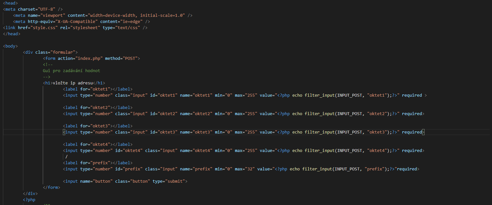
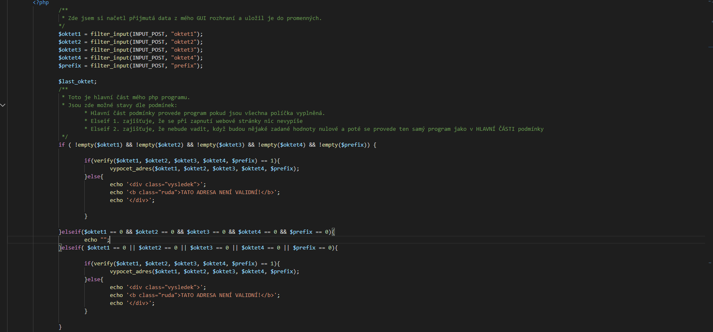

# Analyzátor sítě
#### naprogramovaný v programovacím jazyce PHP [webová aplikace]
## Zde jsou k dispozici screenshoty zdrojového kódu mého analyzátoru sítě:
#### Zde se mi naštěstí podařilo na poslední chvíli opravit tu chybu, která mne svázala ruce v JAVĚ [Analyzátor sítě JAVA](https://github.com/Petrones500078/Ukoly/tree/master/Analyzator%20site/JAVA),  která se týkala těch hostů.

## 21.03.2020 jsem si všiml, že zde v php programu mám chybu... naleznete zde i opravený soubor, kde je to bez chyby... udělám to proto, aby mi to nepokazilo známku z předmětu a zároveň jsem dal najevo že o ní vím a opravil jsem ji.
#### [OPRAVENÝ PROGRAM](https://github.com/Petrones500078/Ukoly/tree/master/Analyzator%20site/PHP/source%20codes/OPRAVENÝ%20PROGRAM)

### GUI (nedůležité):

### PHP :

### CSS (nedůležité, ale krásné)

### VÝSLEDEK MÉHO PROGRAMU:
# MŮJ PROGRAM SI MŮŽETE DOKONCE I VYZKOUŠET NA MÉM HOSTINGU:
# [michael.petro.sweb.cz](http://michael.petro.sweb.cz/) -----> [IP_adresy](http://michael.petro.sweb.cz/WAP/IP_adresy/)

### VÝSLEDEK:

